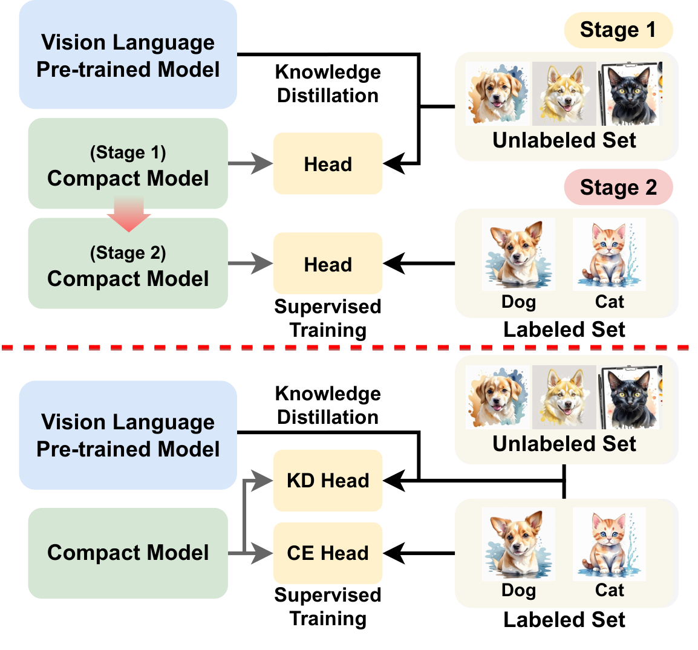
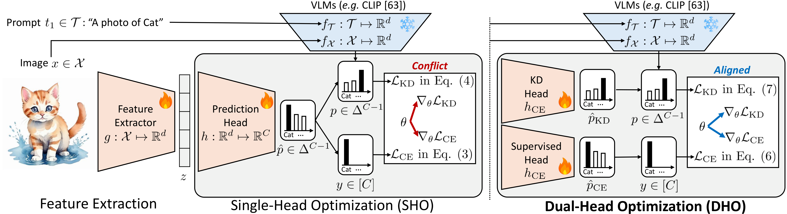

[](https://arxiv.org/abs/2505.07675)
[](https://paperswithcode.com/sota/semi-supervised-image-classification-on-1?p=simple-semi-supervised-knowledge-distillation)
[](https://paperswithcode.com/sota/semi-supervised-image-classification-on-2?p=simple-semi-supervised-knowledge-distillation)

# DHO: Simple Few-shot Semi-supervised Knowledge Distillation from Vision-Language Models via Dual-Head Optimization

<div style="float: right; margin: 0 0 1em 1em;">
  
</div>

[Seongjae Kang](https://erjui.github.io/), [Dong Bok Lee](#), [Hyungjoon Jang](#), [Sung Ju Hwang](#)

[[Project Page](https://huggingface.co/papers/2505.07675)] [[Paper](https://arxiv.org/abs/2505.07675)]

- ✨ Introduces a **dual-head optimization** strategy for semi-supervised distillation
- 🏆 Achieves **state-of-the-art** on ImageNet semi-supervised learning (both 1% and 10% labeled data)
- 🎯 Achieves **state-of-the-art** on out-of-distribution (OOD) benchmarks
- 🔄 Enables efficient transfer from VLMs (e.g., CLIP) to smaller student models
- 🧩 Simple, scalable, and easy to integrate into existing pipelines

## 🔥 News

* **[2024.05.20]** 📦 Code and checkpoints released!
* **[2024.05.13]** 📄 DHO paper is released.

## 🛠️ Code

<div align="center">
  
</div>

### 🚀 Training DHO

We provide convenient script files for running all experiments:
- `scripts_vlm.sh`: For VLM-related experiments
- `scripts_imgnet.sh`: For all ImageNet experiments
- `scripts_others.sh`: For experiments on other datasets

These script files run multiple experiments in batch, while the individual training commands below can be used to run specific experiments separately.

#### ImageNet (low-shot semi-supervised setting either 1% or 10%)

**Zero-shot teacher distillation:**
```bash
CUDA_VISIBLE_DEVICES=0,1,2,3,4,5,6,7 torchrun --nproc_per_node=8 --master_port=29500 train_imgnet_semi.py \
    --teacher_model "ViT-L-14-336px" \
    --student_model "apple/DFN5B-CLIP-ViT-H-14-378" \
    --lr 5e-5 \
    --train_epoch 32 \
    --batch_size 256 \
    --percent 1.0 \
    | tee ./logs/imagenet/imgnet_lowshot.log
```

**Important parameters explained:**
- `--percent`: Amount of labeled data to use. Options:
  - `1.0`: Uses 1% of labeled ImageNet data
  - `10.0`: Uses 10% of labeled ImageNet data
- `--teacher_model`: Vision-Language model to distill from. Options:
  - `"ViT-L-14-336px"`: CLIP ViT-Large model with 336px input size
  - `"apple/DFN5B-CLIP-ViT-H-14-378"`: Apple's CLIP ViT-Huge model
- `--student_model`: Target model to transfer knowledge to. Options:
  - `"ViT-B-16"`: ViT-Base with 16x16 patch size (smaller, faster model)
  - `"ViT-L-14-336px"`: Same architecture as potential teacher (for high-capacity students)
- `--root_path`: Path to the dataset directory

#### ImageNet (few-shot setting)

**Zero-shot teacher distillation:**
```bash
CUDA_VISIBLE_DEVICES=0,1,2,3 torchrun --nproc_per_node=4 --master_port=29500 train_imgnet.py \
    --dataset imagenet \
    --shots 1 \
    --teacher_type zs \
    --batch_size 256 \
    --train_epoch 10 \
    --lr 0.001 \
    | tee ./logs/imagenet/imgnet_zeroshot.log
```

**Few-shot teacher distillation:**
```bash
CUDA_VISIBLE_DEVICES=0,1,2,3 torchrun --nproc_per_node=4 --master_port=29500 train_imgnet.py \
    --dataset imagenet \
    --shots 1 \
    --teacher_type fs \
    --teacher_ckpt ./ckpt/fewshot_teacher/imagenet/tip_adapter_1shot/best_tip_adapter_F_1shots_round0.pt \
    --batch_size 256 \
    --train_epoch 10 \
    --lr 0.001 \
    | tee ./logs/imagenet/imgnet_fewshot.log
```

**Main parameters explained:**
- `--shots`: Number of samples per class (e.g., 1, 2, 4, 8, 16)
- `--teacher_type`: Type of teacher model
  - `zs`: Zero-shot CLIP teacher (no fine-tuning)
  - `fs`: Few-shot teacher (requires checkpoint path)
- `teacher_ckpt`: Path to the few-shot teacher checkpoint
- `--root_path`: Path to the dataset directory

#### Other Datasets (few-shot setting)

**Zero-shot teacher distillation:**
```bash
CUDA_VISIBLE_DEVICES=0 python train_others.py \
    --dataset caltech101 \
    --shots 1 \
    --teacher_type zs \
    --student_model res18 \
    --batch_size 64 \
    --train_epoch 10 \
    --lr 0.001 \
    --root_path ./data \
    | tee ./logs/caltech101/others_zeroshot.log
```

**Few-shot teacher distillation:**
```bash
CUDA_VISIBLE_DEVICES=1 python train_others.py \
    --dataset caltech101 \
    --shots 1 \
    --teacher_type fs \
    --teacher_ckpt ./ckpt/fewshot_teacher/caltech101/tip_adapter_1shot/best_tip_adapter_F_1shots_round0.pt \
    --student_model res18 \
    --batch_size 64 \
    --train_epoch 10 \
    --lr 0.001 \
    --root_path ./data \
    | tee ./logs/caltech101/others_fewshot.log
```

**Parameters for other datasets:**
- `--dataset`: Name of the dataset (e.g., `caltech101`, `oxford_pets`, `stanford_cars`, etc.)
- `--shots`: Number of samples per class (e.g., 1, 2, 4, 8, 16)
- `--teacher_type`: Type of teacher model
  - `zs`: Zero-shot CLIP teacher (no fine-tuning)
  - `fs`: Few-shot teacher (requires checkpoint path)
- `teacher_ckpt`: Path to the few-shot teacher checkpoint
- `--student_model`: Student architecture
  - `res18`: ResNet-18 (lightweight option)
  - Other options: `mobilenet`
- `--root_path`: Path to the dataset directory

**Note:** For few-shot teacher distillation on other datasets, ensure that the `--teacher_ckpt` path points to the correct pre-trained few-shot teacher model for your specific dataset and shot setting.

## 📊 Pretrained Models

<div align="center">

| Dataset | Student Model | Teacher Model | Labeled Data | Top-1 Acc. | Download |
|:-------:|:------------:|:-------------:|:------------:|:----------:|:--------:|
| ImageNet | ViT-B/16 | ViT-H/14 | 1% | 81.6 | [Link](https://huggingface.co/erjui/dho/resolve/main/vit_b_1.pt) |
| ImageNet | ViT-B/16 | ViT-H/14 | 10% | 82.8 | [Link](https://huggingface.co/erjui/dho/resolve/main/vit_b_10.pt) |
| ImageNet | ViT-L/14 | ViT-H/14 | 1% | 84.6 | [Link](https://huggingface.co/erjui/dho/resolve/main/vit_l_1.pt) |
| ImageNet | ViT-L/14 | ViT-H/14 | 10% | 85.9 | [Link](https://huggingface.co/erjui/dho/resolve/main/vit_l_10.pt) |

</div>

## 📝 Citation

```bibtex
@article{kang2025simple,
  title={Simple yet Effective Semi-supervised 
  Knowledge Distillation from Vision-Language 
  Models via Dual-Head Optimization},
  author={Kang, Seongjae and Lee, Dong Bok and Jang, Hyungjoon and Hwang, Sung Ju},
  journal={arXiv preprint arXiv:2505.07675},
  year={2025}
}
```

## 🙏 Acknowledgement

We appreciate the open-source implementations from [Tip-Adapter](https://github.com/gaopengcuhk/Tip-Adapter), [CLIP](https://github.com/openai/CLIP), and [OpenCLIP](https://github.com/mlfoundations/open_clip).
